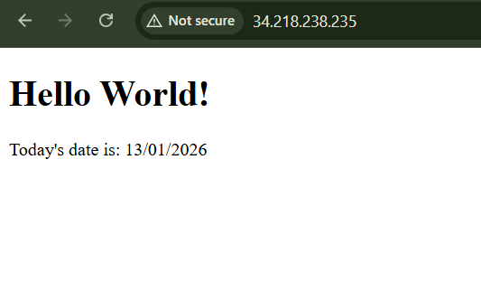

# AWS SSH Key Setup for lab 2 by Jerry Hunt and Sami Jabri

This project uses an SSH key pair to securely access AWS EC2 instances.

## Generating the SSH Key Pair

Run the following command in your terminal to generate the key:

```bash
ssh-keygen -t ed25519 -f ~/.ssh/wkone -C "wkone key"

- `-t ed25519` → Specifies the key type. Ed25519 is modern, fast, and more secure than RSA.  
- `-f ~/.ssh/wkone` → File path for the private and public keys. The private key will be `~/.ssh/wkone` and the public key `~/.ssh/wkone.pub`.  
- `-C "wkone AWS key"` → Adds a comment to help identify this key.  

```

